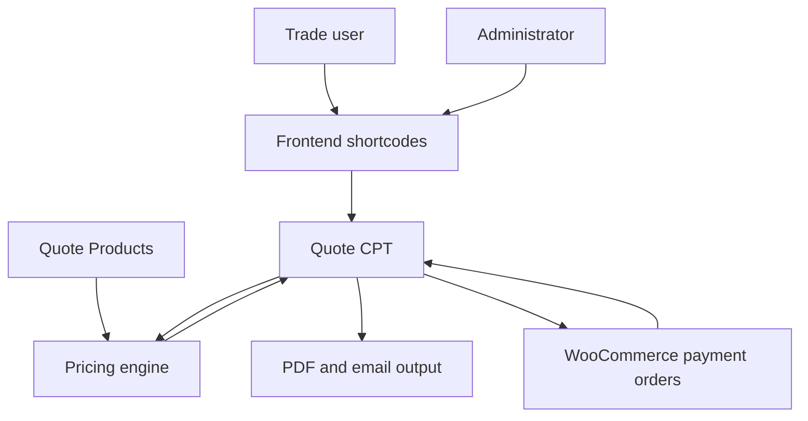

# System overview

## Design

Quote System is a frontend-first WordPress application. A Quote post owns the project, selections, components, prices, workflow state and links to its payment orders.



## Source-of-truth boundaries

| Data | Source of truth |
|---|---|
| Project/customer/specifications/components | Quote CPT post meta |
| Workflow stage | Quote post status |
| Quote ownership | Quote `post_author` |
| Product selection and pricing configuration | Quote Product CPT + Product Type taxonomy |
| Deposit/final payment transaction | WooCommerce order |
| Link between payment and quote | Meta on both the Quote and WooCommerce order |
| PDF content | Calculated at request time from the Quote |

WooCommerce is deliberately downstream. A payment callback changes the Quote status, but the order is not used to reconstruct the quote.

## Bootstrap order

`quote-system.php` defines:

```php
QS_VERSION
QS_PATH
QS_URL
```

It then loads files in this order:

1. CPTs and taxonomy
2. workflow statuses
3. pricing
4. quote numbering
5. repeaters
6. WordPress-admin metaboxes
7. email helpers
8. shared template helpers
9. PDFs
10. WooCommerce integration
11. frontend shortcode files
12. Dompdf autoloader
13. admin list/pricing pages

Load order matters. For example, the builder calls repeater and pricing functions, and the shared review page calls admin-dashboard action helpers.

## Architectural constraints

- No service container or autoloader is used for plugin code.
- Functions use the `qs_` prefix.
- JavaScript is currently inline in the PHP renderer that owns the screen.
- CSS is enqueued globally on the frontend rather than conditionally by shortcode.
- Files under `dompdf/` are third-party code and should not be edited manually.
- Quote Product pricing supports current and legacy/ACF-compatible raw meta shapes.

## Roles in the same review page

`[quote_review]` is shared:

- a trade owner receives Edit/Submit or My Quotes/Download actions;
- a user with `edit_others_posts` receives pricing, document and workflow actions.

The Quote remains authored by the trade account. Administrator access is capability-based and does not change ownership.

## Why structured component meta

Each component group is stored as an array under one post-meta key:

```php
_qs_doors_drawers
_qs_end_panels
_qs_fillers
_qs_kickboards
```

This keeps one Quote self-contained and avoids an extra CPT/table for every door or panel. `repeaters.php` owns the allowed row schema so frontend, WordPress admin, pricing, review and PDFs agree.
