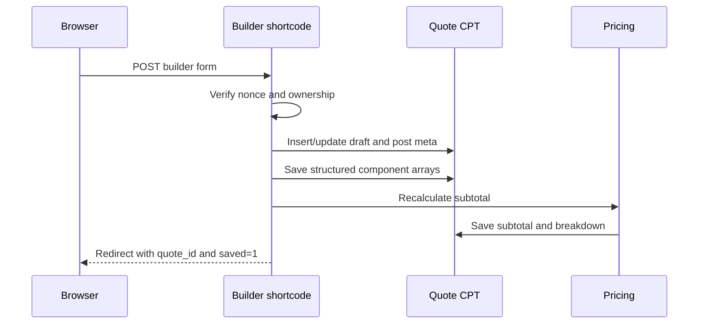

# Request lifecycle

This page maps browser requests to PHP entry points and saved state.

## Create or update a draft



PHP path:

1. `qs_quote_builder_shortcode()` sees `qs_save_draft` or `qs_review_quote`.
2. `qs_builder_save_quote()` validates and writes data.
3. `qs_save_component_rows()` sanitises all repeaters.
4. `qs_recalculate_quote_pricing()` writes calculated pricing meta.
5. Supporting documents are uploaded to Media Library only for the normal form submission.

## Live subtotal

The builder waits 700 ms after a relevant change, then posts the current form to:

```text
/wp-admin/admin-ajax.php
action=qs_builder_recalculate
```

`qs_builder_ajax_recalculate()` calls `qs_builder_save_quote($quote_id, false)`. This means live pricing **also creates/updates a real draft**. Uploads are removed from the AJAX `FormData`, so files are not uploaded during subtotal calculation.

The response updates:

- the subtotal text;
- the in-memory `quoteId`;
- browser URL parameters `quote_id` and `saved=1`.

## Submit a quote

1. Trade user opens `/quote-review/?quote_id=...`.
2. `qs_quote_review_shortcode()` checks ownership and draft state.
3. Submit form nonce is verified.
4. `qs_update_quote_status()` changes the post status to `pending_review`.
5. `qs_email_quote_submitted()` emails the WordPress admin address.
6. Browser redirects to `/quote-thank-you/?quote_id=...`.

Administrators are deliberately prevented from using the trade Submit Quote action.

## Admin action

Both the Admin Dashboard and admin version of Quote Review post:

```text
qs_dashboard_action
quote_id
qs_dashboard_action_nonce
```

`qs_admin_dashboard_handle_action()`:

1. checks Quote CPT, nonce and `edit_post`;
2. checks that the action is valid for the current status;
3. updates status/meta or creates a WooCommerce order;
4. returns a text notice.

## Payment callback

WooCommerce calls `qs_handle_payment_complete()` for:

- `woocommerce_payment_complete`;
- `woocommerce_order_status_processing`;
- `woocommerce_order_status_completed`.

The order meta `_qs_quote_id` and `_qs_payment_type` identifies the Quote and moves it to:

- `deposit_paid` for a deposit;
- `paid_in_full` for a balance.

The callback is intentionally idempotent: repeated qualifying WooCommerce hooks set the same final status.

## PDF request

A browser opens one of:

```text
/?download_quote_pdf=123
/?download_jobsheet_pdf=123
```

The `init` handlers validate owner/admin access, read current Quote data, inject PDF-specific CSS, render A4 portrait output with Dompdf, stream inline, and exit.
