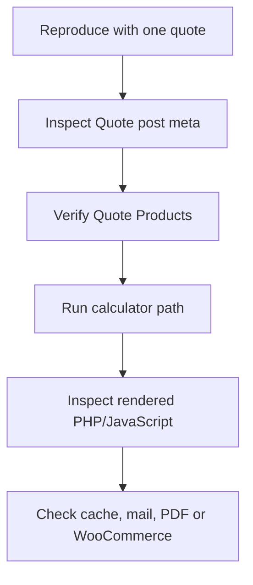

# Debugging guide

Debug from saved data outward. The most useful sequence is:



Write down the quote ID, user ID, role, selected products, component rows and
expected amount before changing code.

## Enable logs safely

On staging, configure WordPress to write errors to `wp-content/debug.log`
without showing them to visitors:

```php
define( 'WP_DEBUG', true );
define( 'WP_DEBUG_LOG', true );
define( 'WP_DEBUG_DISPLAY', false );
```

Do not leave verbose logging enabled indefinitely. Never log passwords, nonces,
payment details, uploaded document contents or complete customer records.

Useful temporary context is the quote ID, product ID/title, method, dimensions,
selected band and numeric result.

## WP-CLI inspection

Examples below are read-only. Replace `68023` with the affected quote ID.

```bash
wp post get 68023 --fields=ID,post_type,post_status,post_author,post_title
wp post meta list 68023
wp post meta get 68023 _qs_doors_drawers --format=json
wp post meta get 68023 _quote_status
wp post meta get 68023 _subtotal
```

Inspect Quote Products and taxonomy terms:

```bash
wp post list --post_type=quote_products --fields=ID,post_title,post_status
wp term list quote_product_type
wp post term list PRODUCT_ID quote_product_type
wp post meta list PRODUCT_ID
```

Serialized arrays should be read through WordPress APIs or WP-CLI, not edited
directly in SQL.

## Symptom guide

### Builder subtotal remains `$0.00`

Check, in order:

1. At least one component row has been added. Product selections and dimensions
   still sitting in an unsaved form row are not part of the subtotal.
2. Project Name exists. Live draft saving does not begin until it has a project
   name.
3. Browser developer tools show a successful request to
   `admin-ajax.php`, not a 403, 500 or nonce error.
4. The response contains the expected quote ID and subtotal.
5. The quote contains `_qs_*` repeater rows after the request.
6. Selected Quote Products are published and assigned to the correct
   `quote_product_type` term.
7. The product contains a valid price for the requested size/method.
8. Product titles required by compatibility logic still match exactly.

The summary is not intentionally delayed until End Panels. It updates when a
complete component row is added and the draft AJAX save/calculation succeeds.

### Review subtotal is correct but builder subtotal is zero

This almost always means the server can calculate saved data, but the builder
did not serialize or save the current rows. Compare the AJAX payload with the
saved `_qs_*` arrays. Check recent edits to row names, indexes and inline
JavaScript selectors.

### Subtotal is correct but total is wrong

The total formula is:

```text
subtotal + shipping - discount + additional charges
```

Check `_shipping`, `_discount` and `_additional_charges`. Runtime helpers
recalculate the amount; legacy `_total`, `_deposit_amount` and `_balance_amount`
values are not authoritative.

For retail quotes, confirm `_pricing_mode` and the `1.2222` multiplier. Do not
apply the retail multiplier a second time in the template.

### Painted Oak or Finish is missing

- `Painted Oak` must exist as a published Timber Quote Product.
- The title must match exactly.
- Painted Oak intentionally shows Paint Colour and hides the independent Finish
  choice.
- A different timber should show the Finished and Raw Finish products.
- The paint price comes from the Quote Product titled `Painted` in the Paint
  taxonomy term.

If the choices exist in the database but not the builder, inspect taxonomy
assignment and the query that loads Quote Products.

### Finger Pull appears for an unsupported profile

The current business rule allows Finger Pull only for Evans, Valley and
30 Shaker. Check the title comparisons and the change handler that refreshes
the handle selector.

### Draft is not saved or disappears

- confirm the user is logged in;
- confirm Project Name is populated;
- inspect the AJAX response;
- verify the nonce and `qs_builder_*` action;
- verify the returned quote ID is retained by the page;
- check that the quote author is the current user;
- check `_quote_status` is `draft`;
- look for PHP warnings before the JSON response.

A live builder save creates a real Quote post, so repeated abandoned tests can
leave draft posts in staging.

### A user can see no quotes

For trade users, queries are intentionally limited by `post_author`. Confirm
the quote author is the user's WordPress ID. For administrators, confirm the
role has `edit_others_posts`.

Archived posts are excluded from the Admin Dashboard. The My Quotes screen
currently has different archive handling; see [Known issues](known-issues.md).

### Wrong controls appear on Quote Review

The same `[quote_review]` page serves trade users and administrators. Admin mode
is capability-based (`edit_others_posts`), not based on a URL flag. Check the
current user's capabilities and ownership of the requested quote.

### Dashboard row will not expand

Check:

- no JavaScript error occurred earlier on the page;
- the row and action panel share the expected data attribute/quote ID;
- the chevron button is not covered by another element;
- the expanded class is toggled;
- page caching has not served an old inline script;
- `admin-dashboard.css` or `my-quotes.css` did not hide the action panel.

### PDF is blank, corrupt or fails

1. Confirm `dompdf/autoload.inc.php` exists.
2. Check PHP memory/time errors.
3. Verify the request user owns the quote or can edit others' posts.
4. Render with a small quote to separate data volume from template errors.
5. Validate generated HTML before sending it to Dompdf.
6. Remove unsupported CSS temporarily to isolate layout faults.
7. Confirm no warning/output is printed before PDF headers.

The PDF templates use the structured `_qs_*` rows. A value visible only in a
legacy meta key may not appear.

### Email is not delivered

- verify the state transition completed;
- inspect `wp_mail()` result and mail/SMTP logs;
- verify the recipient meta and WordPress admin email;
- test a plain WordPress email independently;
- confirm the host is not blocking PHP mail;
- install/configure an SMTP delivery plugin in production;
- check spam and sender-domain SPF/DKIM/DMARC.

Do not repeatedly trigger customer emails during debugging with real addresses.

### Deposit or balance order is wrong

- confirm WooCommerce is active;
- inspect `_woocommerce_deposit_order_id` or the corresponding balance-order
  reference;
- inspect the fee line amount on the WooCommerce order;
- compare the quote subtotal/adjustments immediately before order creation;
- remember that the deposit amount is locked when its order is created;
- verify the WooCommerce completion callback received the intended order.

The integration creates fee-only orders; it does not add catalog products.

### Upload does not finish

- allowed types are JPG, PNG and PDF;
- maximum size is 10 MB;
- confirm PHP `upload_max_filesize` and `post_max_size` are high enough;
- inspect the final form request and Media Library permissions;
- check the attachment IDs saved in `_supporting_documents`.

The thin progress line shown while selecting a file represents browser
`FileReader` progress. The indeterminate line on final submission represents
the actual form upload.

### CSS changes do not appear

- edit the unminified file that is enqueued;
- inspect the stylesheet URL/version in the page source;
- clear page cache, CDN cache and optimization/minification cache;
- confirm the rule is scoped to the correct wrapper;
- compare selector specificity in browser developer tools;
- check theme styles loaded after the plugin.

Asset URLs use `filemtime()` versions, but an HTML/CDN cache can still serve an
old page referencing an older asset.

## Isolate pricing with a minimal fixture

Use one component, quantity `1`, a known width and height, one profile and one
timber. Calculate the expected area or linear metres by hand, then add one
surcharge at a time. This makes it clear which product or adjustment introduces
the error.

For a matrix product, test immediately below, exactly at and immediately above
each size boundary.

## After the fix

Remove temporary logs, recreate the original failure with unchanged test data,
then run the adjacent workflow checks. A subtotal fix can affect PDFs, deposit
orders and historical quotes, so do not stop at the builder screen.
