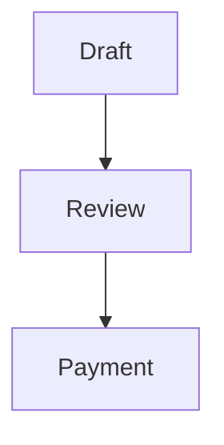

# Maintaining these docs

The documentation is intentionally stored with the plugin source. A code change
is complete only when a future developer can understand the resulting behavior
without reading every implementation file.

## Local preview

From the repository root:

```bash
python -m venv .venv
. .venv/bin/activate
pip install -r requirements-docs.txt
mkdocs serve
```

Open `http://127.0.0.1:8000/`. MkDocs rebuilds after each saved Markdown change.

Before committing:

```bash
mkdocs build --strict
```

Strict mode catches broken navigation entries and documentation warnings.

## Where a change belongs

| Code change | Documentation to update |
|---|---|
| Loaded/renamed file | Architecture → File map |
| New request or data path | Architecture → Request lifecycle |
| Meta key or value shape | Data model and Post-meta dictionary |
| Pricing rule/product type | Quote Products and pricing |
| Status/action/payment change | Business workflow pages |
| Form/UI/JavaScript/CSS change | Frontend feature page |
| PDF/email change | Output page |
| New shortcode/query parameter | Shortcodes and URLs |
| Public function or hook | Functions and hooks |
| Setup/dependency change | Getting started |
| Unresolved defect/limitation | Known issues |

For a feature spanning several layers, update every affected page. Cross-link
instead of copying long explanations.

## Add a page

1. Create a lowercase hyphenated `.md` file in the relevant `docs/` folder.
2. Start with one `#` heading.
3. Add it to `nav` in `mkdocs.yml`.
4. Link it from an existing discoverable page.
5. Run `mkdocs build --strict`.

Use paths relative to the current Markdown file. Do not link to a local
developer's absolute filesystem path.

## Writing conventions

- State what the code does now, separately from a recommendation.
- Name exact functions, files, meta keys, statuses and capabilities.
- Include permissions and failure behavior for every mutating workflow.
- Explain where data is written and which value is authoritative.
- Label legacy compatibility and technical debt honestly.
- Prefer small tables for exact mappings.
- Keep examples safe for staging and mark destructive commands clearly.
- Never place customer data, credentials, nonces or live payment details in
  documentation or screenshots.

When behavior depends on a product title or page slug, write the exact string in
backticks.

## Diagrams

Use Mermaid only when relationships or sequence are clearer visually. Keep
nodes short and add precise details in prose. A rendered diagram must also make
sense in dark mode.

Example:

````markdown

````

## Screenshots

Screenshots are useful for visual matching but age quickly. Prefer explaining
the owning CSS class/file and business behavior in text. If a screenshot is
necessary:

- crop out customer information;
- use a stable file under `docs/assets/`;
- provide descriptive alternative text;
- record the plugin version represented;
- replace it when the interface changes.

## Version and source accuracy

At release time, verify:

- plugin header and `QS_VERSION` match;
- docs describe the current branch, not an earlier ZIP;
- generated PDF/status/button names match the code;
- known issues were not accidentally described as fixed;
- no links reference scratch files or staging-only URLs.

Use Git history to see when documentation changed. Do not maintain a second
independent “master” document outside the repository.

## GitHub Pages

`.github/workflows/docs.yml` builds with `mkdocs build --strict` and deploys the
`site/` artifact after documentation changes reach `main`. Repository Pages
must use **GitHub Actions** as its source.

If the workflow fails:

1. open the failed build log;
2. reproduce with the same Python version and requirements;
3. fix the warning/error rather than disabling strict mode;
4. rerun the workflow.

Dependency upgrades should be made in `requirements-docs.txt` on a branch and
visually reviewed before merge.

## Review checklist

- [ ] Navigation entry exists and opens.
- [ ] Relative links resolve.
- [ ] Exact code names are searchable in the repository.
- [ ] Permissions and data ownership are stated.
- [ ] Business formulas and status transitions are current.
- [ ] Code examples are safe and syntactically valid.
- [ ] Known limitations remain visible.
- [ ] `mkdocs build --strict` passes.
