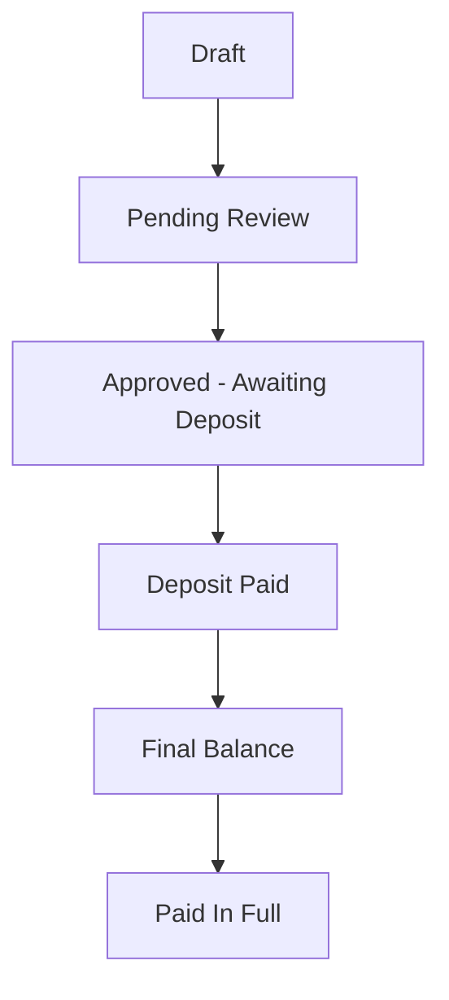
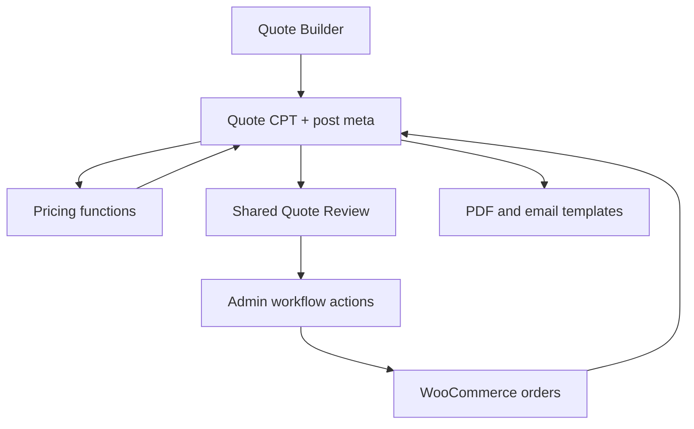

# Quote System developer documentation

This site explains how the **Loughlin Furniture Quote System** WordPress plugin works, where every important behavior lives, and how to change it safely.

The documentation describes plugin version **1.4.1**. It is written for a future developer who may know WordPress but has never seen this repository.

## Start here

- Use [WordPress setup](getting-started/wordpress-setup.md) when installing the plugin on a new site.
- Use [Pages and shortcodes](getting-started/pages-and-shortcodes.md) when a frontend screen returns the wrong page or redirect.
- Read [System overview](architecture/overview.md) before changing architecture.
- Use the [post-meta dictionary](reference/post-meta.md) when tracing saved data.
- Use [Functions and hooks](reference/functions-and-hooks.md) when locating a PHP entry point.
- Use the [debugging guide](development/debugging.md) when a subtotal, PDF, email, payment, or status is wrong.

## Core rules

1. The `quote` custom post type is the single source of truth.
2. Quote fields are saved with normal WordPress post meta.
3. Component rows are structured arrays under `_qs_*` meta keys.
4. Quote Products contain selectable product and pricing data.
5. The frontend application is primary; WordPress admin is a support interface.
6. WooCommerce collects money but does not own quote data.
7. Dompdf renders quotation and job-sheet documents.
8. ACF may be used as an editing interface for Quote Products, but the plugin calculation runtime does not call ACF.

## Business flow

The status of the `quote` post controls the buttons shown in both dashboards and on the shared Quote Review page.

## Main runtime path

## Repository landmarks

| Location | Responsibility |
|---|---|
| `quote-system.php` | Plugin constants, file loading, CSS registration, activation |
| `frontend/` | Builder, review, login, trade dashboard, admin dashboard, thank-you screen |
| `pricing.php` | Quote Product lookup and all pricing formulas |
| `repeaters.php` | Component schemas, sanitisation, storage, reads and counts |
| `statuses.php` | Workflow status registration and updates |
| `integrations/woocommerce.php` | Deposit/final-balance orders and payment callbacks |
| `pdf.php` + `templates/` | Shared data collection, HTML templates and Dompdf streaming |
| `assets/css/` | Shared, page-specific, preview and PDF styles |
| `docs/` | This developer documentation |

!!! warning "Read before changing storage"
    Do not move quote details into WooCommerce orders, ACF fields, or custom tables without a deliberate migration. Review pages, PDFs, pricing, emails, and dashboards currently read the Quote CPT.

## Current dependencies

| Dependency | Use |
|---|---|
| WordPress | Users, capabilities, CPTs, post meta, Media Library, mail and routing |
| WooCommerce | Pay-for-order checkout for deposit and balance |
| Dompdf | A4 quotation and manufacturing job-sheet PDFs; bundled in `dompdf/` |
| Quote Product data | Profiles, timber, finish, paint, accessory and kickboard pricing |
| Site theme fonts | `Cormorant Garamond`, `GT Walsheim`/`GTWalsheim`, then fallbacks |

The plugin has no required JavaScript framework and no required ACF runtime.
