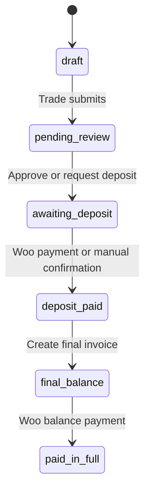

# Quote statuses

The Quote post status is the workflow state. `statuses.php` registers every custom stage except WordPress core `draft`.

## Canonical statuses

| Stored status | Canonical label | Trade/Admin dashboard display |
|---|---|---|
| `draft` | Draft | Draft |
| `pending_review` | Pending Review | Pending Review |
| `awaiting_deposit` | Approved - Awaiting Deposit | Deposit Requested |
| `deposit_paid` | Deposit Paid | Approved |
| `final_balance` | Final Balance | Approved |
| `paid_in_full` | Paid In Full | Completed |

The dashboard intentionally groups `deposit_paid` and `final_balance` into the Approved count.

## Normal transitions



## Transition owners

| Transition | Trigger |
|---|---|
| Draft → Pending Review | Trade Submit Quote form |
| Pending Review → Awaiting Deposit | Admin Mark as Approved or Request Deposit |
| Awaiting Deposit → Deposit Paid | WooCommerce callback or admin manual confirmation |
| Deposit Paid → Final Balance | Admin Create Final Invoice |
| Final Balance → Paid In Full | WooCommerce callback |

`Mark as Approved` changes status without creating a deposit order. `Request Deposit` creates/reuses the order, changes status and emails the customer.

## API

```php
$statuses = qs_get_quote_statuses();
$result   = qs_update_quote_status( $quote_id, 'pending_review' );
```

`qs_update_quote_status()` validates:

- the post exists;
- it is a Quote;
- the target exists in `qs_get_quote_statuses()`.

It does **not** validate the previous status or user permission. The caller owns transition and authorization rules.

## Adding a status

Update all of these:

1. registration map in `qs_register_post_statuses()`;
2. `qs_get_quote_statuses()`;
3. WordPress-admin dropdown JavaScript if needed;
4. trade/admin display labels;
5. status buckets/counts;
6. dashboard action switch;
7. shared review admin-action switch;
8. My Quotes query/grouping/actions;
9. Admin Dashboard query/filter/grouping/actions;
10. CSS status classes in `base.css`, `my-quotes.css`, and `admin-dashboard.css`;
11. WooCommerce callback/other transition code;
12. tests and this documentation.

Do not add a display-only label without adding the stored status to all queries, or quotes can disappear from dashboards.
